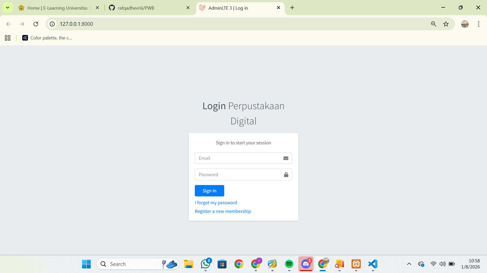
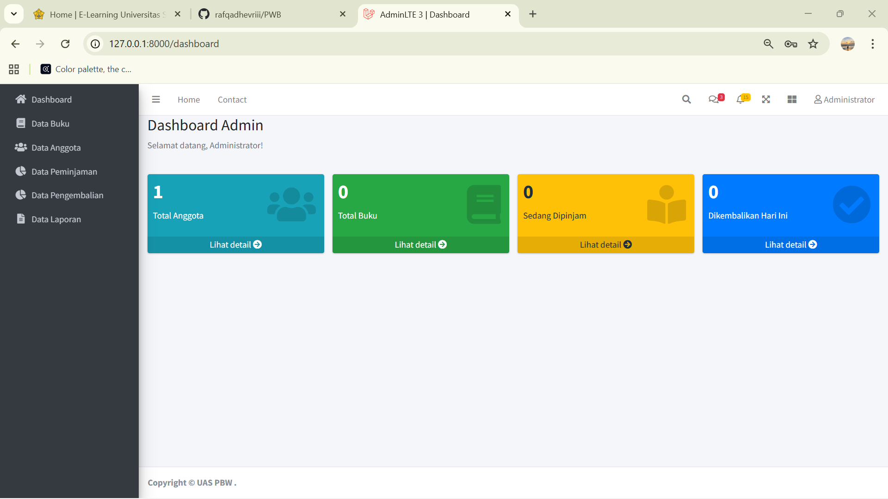
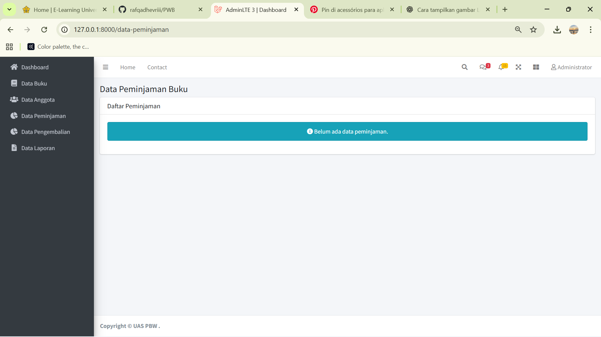
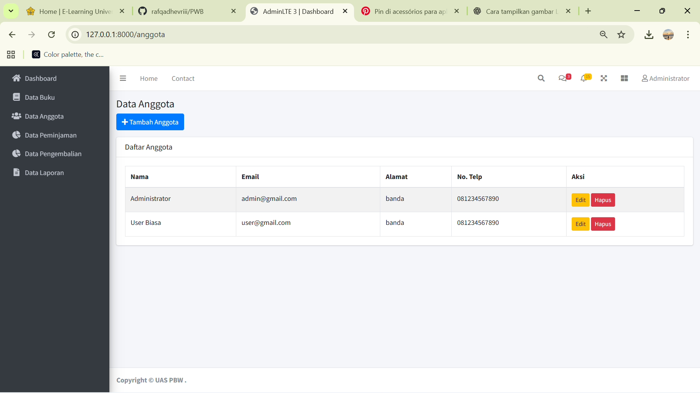
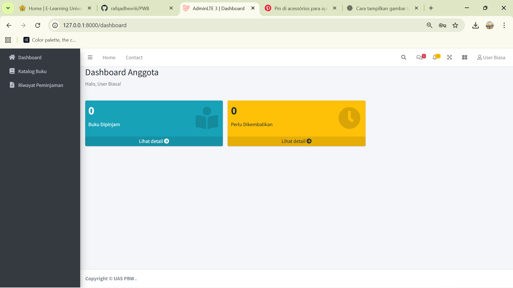
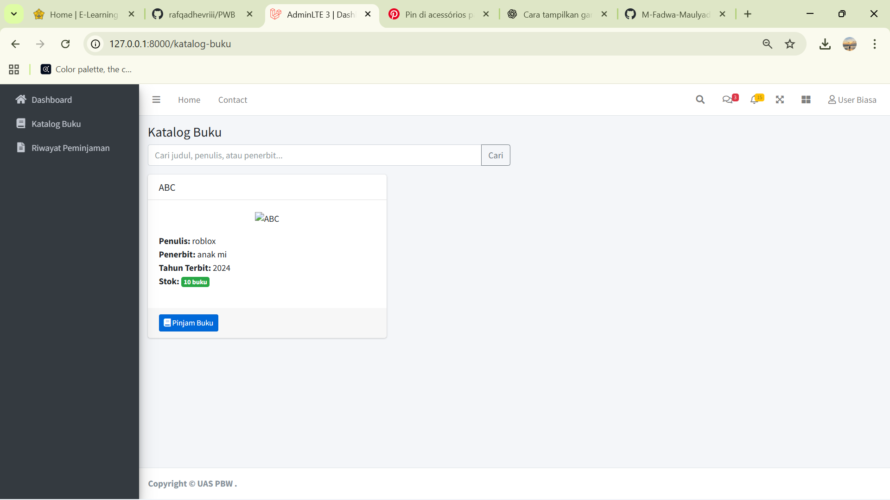
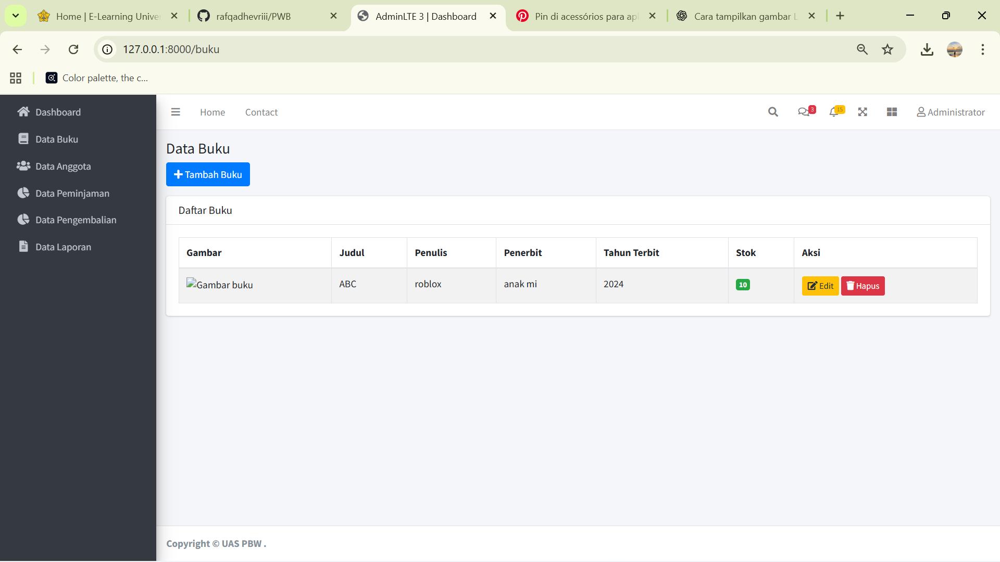
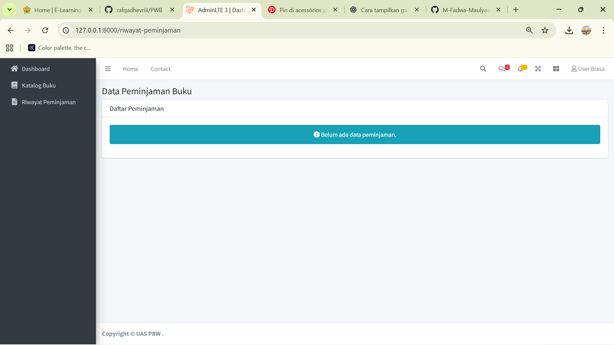

RAFQA DHEVRIANSARI 2408007010021
NOVIA NURFITRIA 2408007010039 

PENJELASAN FITUR PERPUSTAKAAN DIGITAL

Perpustakaan Digital ini dirancang untuk mendukung pengelolaan dan layanan perpustakaan secara daring. Seluruh pengguna mengakses sistem melalui satu halaman login, kemudian fitur akan ditampilkan sesuai dengan peran masing-masing.

LOGIN DAN LOGOUT

Pengguna masuk ke Perpustakaan Digital menggunakan username dan password.
Setelah selesai menggunakan layanan, pengguna dapat keluar dari sistem melalui menu logout.
Sistem secara otomatis mengenali peran pengguna sebagai admin atau user.

FITUR UNTUK ADMIN

Dashboard Admin

Dashboard menampilkan ringkasan kondisi Perpustakaan Digital dalam satu tampilan.
Informasi yang ditampilkan meliputi jumlah total buku, jumlah anggota, jumlah buku yang sedang dipinjam, dan jumlah buku yang tersedia.

Manajemen Buku

Admin mengelola seluruh koleksi buku digital.
Admin dapat menambahkan data buku baru, memperbarui informasi buku, menghapus data buku, serta melihat daftar buku.
Informasi buku mencakup judul, penulis, tahun terbit, jumlah stok, dan cover buku.

Manajemen Anggota

Admin mengelola data anggota Perpustakaan Digital.
Admin dapat menambah, mengubah, menghapus, serta melihat data anggota yang terdaftar.

Peminjaman dan Pengembalian Buku

Admin mencatat transaksi peminjaman buku oleh anggota.
Sistem menyimpan data peminjam, tanggal peminjaman, dan tanggal pengembalian.
Saat buku dikembalikan, status buku diperbarui secara otomatis dan keterlambatan dapat dihitung.

Laporan

Admin dapat mengakses laporan data buku, data anggota, serta data peminjaman dan pengembalian buku.
Laporan digunakan sebagai dokumentasi dan pemantauan aktivitas perpustakaan.

FITUR UNTUK USER ATAU ANGGOTA

Dashboard User

Dashboard menampilkan ringkasan aktivitas anggota, seperti jumlah buku yang sedang dipinjam dan status peminjaman.

Katalog Buku

User dapat melihat katalog buku yang tersedia di Perpustakaan Digital.
Setiap buku menampilkan informasi detail dan status ketersediaan.
Peminjaman Buku

User dapat mengajukan peminjaman buku melalui sistem sesuai ketentuan yang berlaku.

Riwayat Peminjaman

User dapat melihat riwayat peminjaman buku yang pernah dilakukan, termasuk tanggal pinjam, tanggal kembali, dan status peminjaman.

Penutup
Perpustakaan Digital ini menggunakan satu sistem login dengan pembagian fitur berdasarkan peran pengguna. Admin berfokus pada pengelolaan data dan laporan, sedangkan user berfokus pada pencarian dan peminjaman buku. Seluruh fitur dirancang agar layanan perpustakaan dapat berjalan lebih teratur, jelas, dan mudah digunakan.
